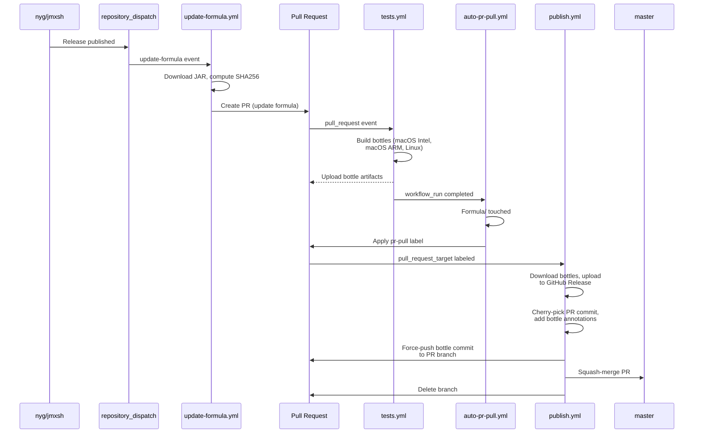
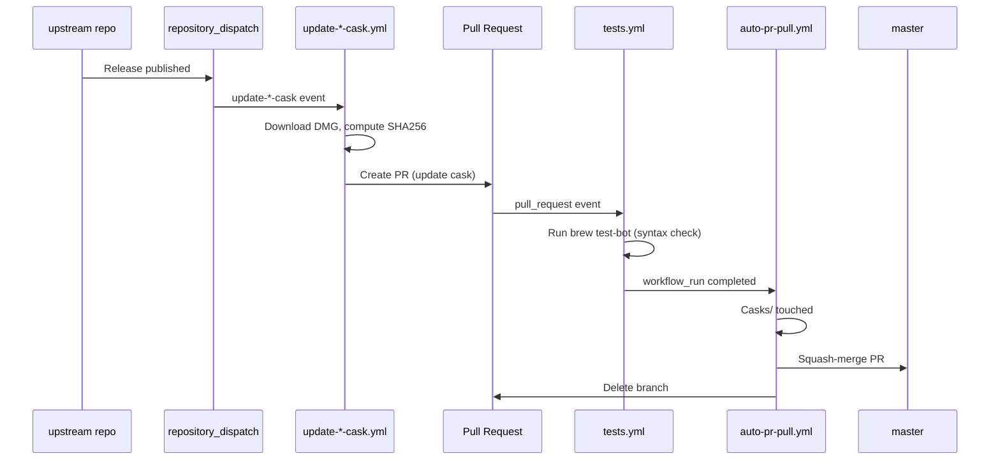

# Automated Package Updates

When a new release is published in an upstream repository, the corresponding formula or cask in this tap is updated, tested, and merged automatically — no manual steps required.

Every update workflow can also be triggered manually via [`workflow_dispatch`](https://docs.github.com/en/actions/managing-workflow-runs-and-deployments/managing-workflow-runs/manually-running-a-workflow), taking a version and an optional precomputed SHA256.

Both pipelines share the same test and routing stage; they differ only in what happens after the tests pass:

| | Formula (`jmxsh`) | Casks |
|---|---|---|
| Bottles built | Yes (macOS Intel, macOS ARM, Linux) | No |
| GitHub Release in this tap | Yes (holds the bottles) | No |
| Merged by | [`publish.yml`](../.github/workflows/publish.yml) via `brew pr-pull` | [`auto-pr-pull.yml`](../.github/workflows/auto-pr-pull.yml) directly |

## Shared stages

### Test

[`tests.yml`](../.github/workflows/tests.yml), workflow name "brew test-bot". Runs on every pull request across `macos-15-intel`, `macos-26`, and a Linux container. Always runs `brew test-bot --only-tap-syntax`; on pull requests it also runs `--only-formulae`, which builds bottles and uploads them as workflow artifacts. Casks produce no bottles, so for a cask PR this stage is effectively a syntax check.

### Route

[`auto-pr-pull.yml`](../.github/workflows/auto-pr-pull.yml), workflow name "Auto-publish update PRs". Triggered by a successful `brew test-bot` `workflow_run` on any branch starting with `update-` in this repository. It inspects the PR's changed files and routes accordingly:

- **`Formula/` touched** — applies the `pr-pull` label, which hands off to `publish.yml`. The label is applied with `HOMEBREW_TAP_TOKEN` rather than `GITHUB_TOKEN`, because events from `GITHUB_TOKEN` don't trigger downstream workflows.
- **`Casks/` touched** — squash-merges the PR directly through the API and deletes the branch. Casks have no bottles and need no release, so routing them through `brew pr-pull` would only run unnecessary machinery.
- **Neither** — logs a warning and does nothing.

## Formula pipeline (jmxsh)

### Overview

### Step-by-step

1. **Trigger** — A release in `nyg/jmxsh` sends a [`repository_dispatch`](https://docs.github.com/en/actions/writing-workflows/choosing-when-your-workflow-runs/events-that-trigger-workflows#repository_dispatch) event to this repository with the new version, JAR URL, and Java version.

2. **Update formula** ([`update-formula.yml`](../.github/workflows/update-formula.yml)) — Downloads the JAR, computes its SHA256, updates the formula's `url`, `sha256`, and optionally `depends_on` fields, then opens a PR on a branch named `update-jmxsh-<version>`.

3. **Test** — See [Test](#test) above. Bottles are built and uploaded.

4. **Route** — See [Route](#route) above. The PR touches `Formula/`, so the `pr-pull` label is applied.

5. **Publish** ([`publish.yml`](../.github/workflows/publish.yml), workflow name "brew pr-pull") — Triggered by the `pr-pull` label. Runs `brew pr-pull`, which downloads the bottle artifacts, uploads the bottle tarballs to a GitHub Release in this tap, cherry-picks the PR commit, and amends it with a `bottle` block. The bottle-annotated commit is force-pushed back to the PR branch, and once GitHub reports the PR mergeable again it is squash-merged via `gh pr merge --squash --delete-branch`.

## Cask pipeline (crypto-tools, qoqa-compta, wiktionary-to-kindle)

Casks don't require bottles, so the pipeline is shorter — no bottle build, no `brew pr-pull` publish step, and **no GitHub Release in this tap**. Homebrew installs a cask by reading the `.rb` file from the default branch and downloading the DMG directly from the URL inside it, which is hosted on the upstream repository's own release. A release in this tap would serve no purpose.

Each cask has its own update workflow, dispatch event type, and PR branch prefix:

| Cask | Workflow | `repository_dispatch` type | PR branch |
|---|---|---|---|
| `crypto-tools` | [`update-crypto-tools-cask.yml`](../.github/workflows/update-crypto-tools-cask.yml) | `update-crypto-tools-cask` | `update-crypto-tools-<version>` |
| `qoqa-compta` | [`update-cask.yml`](../.github/workflows/update-cask.yml) | `update-cask` | `update-qoqa-compta-<version>` |
| `wiktionary-to-kindle` | [`update-wiktionary-to-kindle-cask.yml`](../.github/workflows/update-wiktionary-to-kindle-cask.yml) | `update-wiktionary-to-kindle-cask` | `update-wiktionary-to-kindle-<version>` |

`update-cask.yml` is the original workflow and predates the other two, which is why it carries the generic name and dispatch type while only handling `qoqa-compta`. Apart from the package name, the DMG URL, and the cask path, all three are identical.

### Overview

### Step-by-step

1. **Trigger** — A release in the upstream repository sends a `repository_dispatch` event of the type listed above to this repository, with the new version and optionally a precomputed DMG SHA256.

2. **Update cask** — The matching workflow builds the DMG URL from the version (`<package>-<version>-macos-arm64.dmg`), downloads the DMG and computes its SHA256 if one wasn't supplied (retrying up to five times, since the asset may not be served immediately after the release is created), rewrites the cask's `version` and `sha256` fields with `sed`, verifies both replacements landed, and opens a PR.

3. **Test** — See [Test](#test) above. Tap syntax only; no bottles.

4. **Merge** — See [Route](#route) above. The PR touches `Casks/`, so it is squash-merged directly and the branch is deleted. No label and no human step are involved, and no GitHub Release is created.
